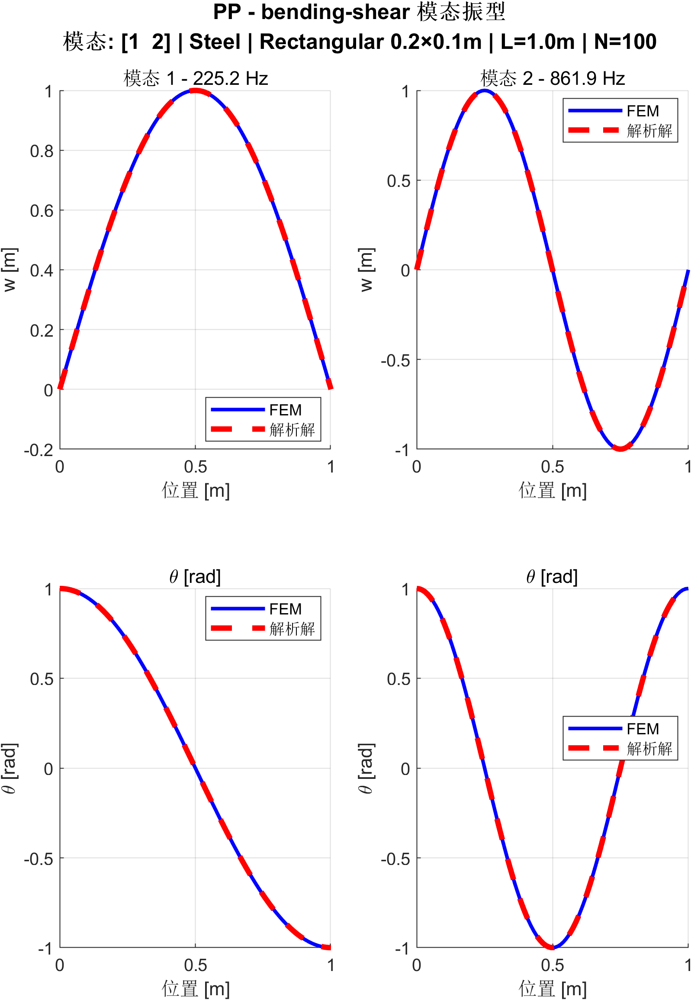
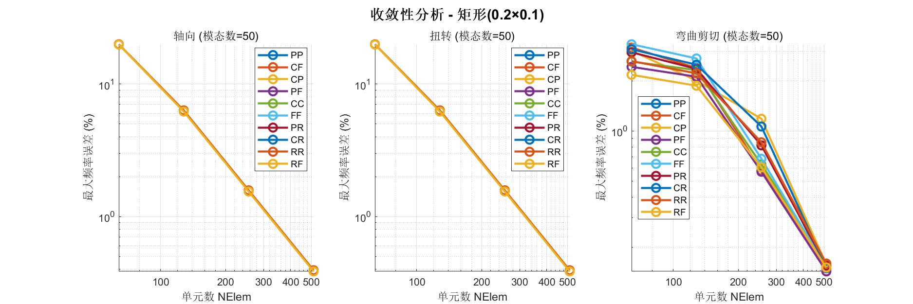

[English](./README.md) | **简体中文**

---

# BeamElem

> Timoshenko 梁模态分析有限元求解器

---

## 📋 依赖

- **MATLAB** — 核心计算环境
- **chebfun** — 特征方程求根工具（已包含在项目中）
  - 官网：[https://www.chebfun.org/](https://www.chebfun.org/)
  - 功能：计算精度约为15位有效数字的开源包，提供求根、积分、微分方程求解等功能

---

## 📍 项目定位

### Timoshenko 梁模态分析

Timoshenko 梁理论在 Euler-Bernoulli 理论基础上增加剪切变形和转动惯性项，更适合短粗梁和高阶模态分析。标准有限元方法在求解 Timoshenko 梁时存在剪切自锁问题：单元在细长梁极限时刚度矩阵过度刚化，导致计算结果不收敛。解析解虽然能给出精确频率，但不同边界条件下特征方程形式差异大，数值求根容易漏根或产生虚假解。

### 本项目的作用

本项目实现 一维 Timoshenko 梁的有限元数值求解、解析解计算和误差验证，提供模态频率、振型和可视化结果。支持 10 种边界条件（PP/CF/CC/FF/CP/PR/CR/RR/RF/PF）和 3 类振动（轴向/扭转/弯曲-剪切），内置材料库和截面属性计算，自动输出频率误差、MAC 值和振型图。

**工作流程**：

1. **参数化建模** — 从材料库选择属性，计算截面几何参数
2. **有限元求解** — 构造刚度和质量矩阵，施加边界约束，求解特征值问题
3. **解析解计算** — 计算三类振动的理论频率和模态振型
4. **自动验证** — 对比频率误差和 MAC 值，自动匹配模态
5. **结果缓存** — 基于参数生成唯一标识，避免重复计算
6. **可视化** — 读取缓存数据，绘制模态振型图

**拓展实验**：新增材料或截面类型仅需在 `+parameters` 模块添加配置。扩展到耦合模型需修改 `+matrix`、`+solvers` 等模块，详见 [`docs/project_structure.md`](docs/project_structure.md)。

## 🚀 快速开始

**详细的使用方法、参数配置和注意事项请参考**：[`example_basic.m`](example_basic.m)

```matlab
% 添加项目路径
addpath(genpath('src'));
addpath(genpath('chebfun'));

% 定义材料
mat = parameters.MaterialLibrary.Steel();

% 定义截面（矩形：宽20cm×高10cm）
sec = parameters.SectionLibrary.Rectangular(0.2, 0.1);

% 创建梁模型（长度1m）
beam = parameters.BeamModel(mat, sec, 'L', 1.0);

% 求解（简支梁，100单元，10模态）
wf_result = workflow.solve('PP', beam, 100, 10);

% 可视化第1阶弯曲模态
fem_result = wf_result.bending_shear.fem_result;
visualization.plotMode(fem_result, 1);
```

**输出示例**：

```
━━━━━━━━━━━━━━━━━━━━━━━━━━━━━━━━━━━━━━━
【Axial】轴向振动
━━━━━━━━━━━━━━━━━━━━━━━━━━━━━━━━━━━━━━━
Mode   FEM (Hz)   Analytical (Hz)   Error     MAC
  1     3184.71      3184.71       0.00%    1.0000
  2     6369.43      6369.43       0.00%    1.0000
  3     9554.14      9554.14       0.00%    1.0000
  ...

━━━━━━━━━━━━━━━━━━━━━━━━━━━━━━━━━━━━━━━
【Bending-Shear】弯曲-剪切振动
━━━━━━━━━━━━━━━━━━━━━━━━━━━━━━━━━━━━━━━
Mode   FEM (Hz)   Analytical (Hz)   Error     MAC
  1      837.42       838.15       +0.09%   0.9998
  2     2149.33      2153.26       +0.18%   0.9997
  3     3765.98      3773.01       +0.19%   0.9997
  ...

======== 误差统计 ========
【轴向振动】
  最大频率误差: 0.0000%
  平均MAC值: 1.000000

【扭转振动】
  最大频率误差: 0.0000%
  平均MAC值: 1.000000

【弯曲-剪切振动】
  最大频率误差: 0.1832%
  平均MAC值: 0.999712

💾 Results cached to: .cache/4BB0F885_PP_N100_M10/
```

### 缓存结构说明

**缓存地址格式**：`.cache/<hash>_<BC>_N<NElem>_M<n_modes>/`

**参数说明**：
- `<hash>`：梁模型参数的哈希值（材料+截面+长度），示例：`4BB0F885`
- `<BC>`：边界条件，示例：`PP`（简支-简支）
- `N<NElem>`：单元数，示例：`N100`（100个单元）
- `M<n_modes>`：模态数，示例：`M10`（10个模态）

**缓存内容**：

```text
.cache/4BB0F885_PP_N100_M10/
├── metadata.mat                        # 梁模型参数和求解配置
├── axial/                              # 轴向振动结果
│   ├── fem_result.mat                  # FEM 结果（频率、模态）
│   ├── ana_result.mat                  # 解析解结果
│   └── comp_result.mat                 # 对比结果（误差、MAC值）
├── torsion/                            # 扭转振动结果
│   └── (同样三个文件)
└── bending_shear/                      # 弯曲-剪切振动结果
    └── (同样三个文件)
```

### 模态振型可视化

<div align="center">
  
  <p><i>图1：弯曲-剪切模态振型（模态1-2，简支边界）— 有限元结果（蓝色实线）vs. 解析解（红色虚线）</i></p>
</div>

### 收敛性分析

有限元求解器在所有边界条件下均展现出优秀的收敛性。

> **完整收敛性测试代码**：[`src/+workflow/tests/convergence/`](src/+workflow/tests/convergence/)

以矩形截面梁（0.2m × 0.1m，50个模态）为例，收敛性测试结果如下：

<div align="center">
  
  <p><i>图2：矩形截面梁收敛性测试（0.2m × 0.1m，50个模态）— 最大频率误差在10种边界条件均表现出一致的二阶收敛特性</i></p>
</div>

---

## 📁 项目结构

```text
BeamElem/
├── example_basic.m                     # 基本使用示例
├── chebfun/                            # chebfun 开源计算库
├── .cache/                             # 计算缓存
├── src/                                # 核心源代码
│   ├── +workflow/                      # 求解流程控制（含网格收敛性测试）
│   ├── +parameters/                    # 参数管理
│   ├── +solvers/                       # 有限元求解器
│   ├── +matrix/                        # 单元矩阵生成（刚度/质量）
│   ├── +analytical/                    # 解析解模块（轴向/扭转/弯曲-剪切）
│   ├── +comparison/                    # FEM与解析解对比
│   ├── +boundary_conditions/           # 边界条件管理
│   └── +visualization/                 # 可视化工具（含测试示例）
├── reference/                          # 理论基础文献
│   └── REFERENCES.md
└── docs/                               # 项目文档
    ├── code_corrections.md
    ├── analytical_solution_limitations.md
    └── project_structure.md            # 详细目录结构
```

> 📖 详细目录结构请参考：[`docs/project_structure.md`](docs/project_structure.md)

---

## 📚 理论基础

项目基于以下核心文献实现：
- **Friedman & Kosmatka (1993)** — 避免剪切自锁的改进单元
- **Khasawneh & Segalman (2019)** — 弯曲-剪切振动解析解
- **Blevins (1979)** — 轴向和扭转振动频率公式
- **Roark's Formulas** — 截面几何属性
- **Hutchinson (2001)** — 剪切修正系数

> 📖 所有文献和代码引用详见：[`reference/REFERENCES.md`](reference/REFERENCES.md)
